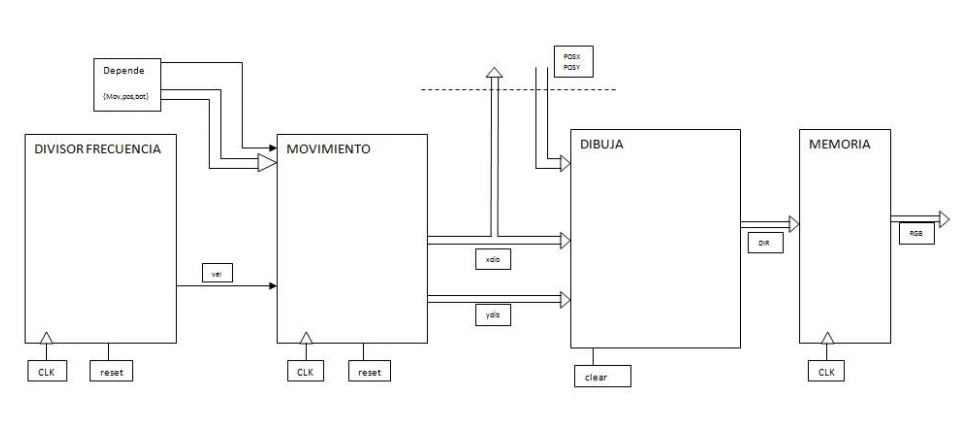
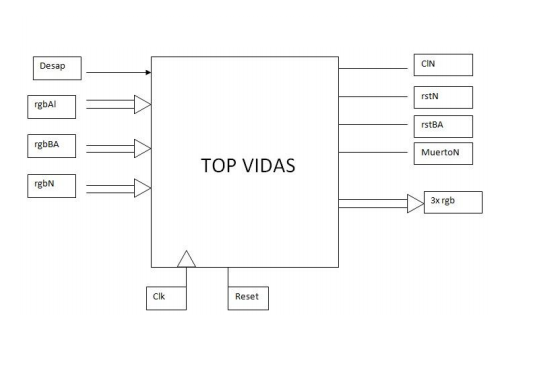
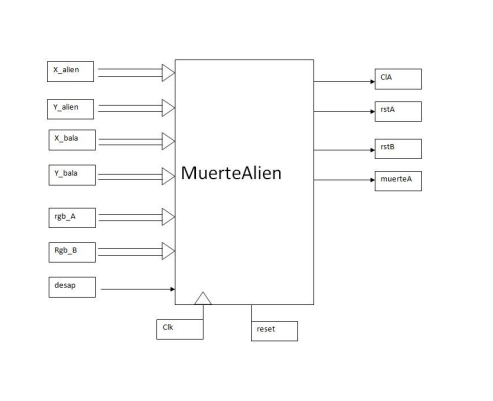

# VGA driver + Space Invaders on Xilinx Spartan III

This repository contains a *VGA driver + Space Invaders* :space_invader: descripted in **VHDL** language for **FPGA**'s.
Specifically, it has been built on Xilinx ISE for the board Spartan III.

* In contrast with other electronic boards with built-in video driver, we descripted the driver circuit and it's behaviour in *VHDL (VHSIC Hardware Description Language)*. This means that the code we programmed in Xilinx'ide **creates a physical electronic circuit** on the Spartan board.
* *VHDL* and *FPGA* are a powerful technology that are commonly used in research :microscope: and space applications :rocket:.
* The game isn't perfect, but it is nice to test the VGA driver.

- - - -

## :memo: Documentation

Here's some basic documentation for the case you need to use some parts of this project. It wasn't made with best programming practices, but it can be helpful.

### Blocks
- - - -

#### DIBgenerico

This block receives a draw position (dib stands for spanish 'dibujo' wich means draw) and that is where the current position that the driver is painting. The output is the relative position for the sprite (position from the start of the sprite to the current position the driver is painting if it's on the sprite range).
* Inputs: draw start coordinates `(xdib, ydib)`, driver current painting postion `(Pos_x, Pos_y)`
* Outputs: relative vector postion `(DIR1, DIR2)`

#### MovNave

This block generates the position of the ship :rocket: (player) by receiving the movement buttons signals as input.
* Inputs: `left`, `right` button signals and `vel` wich comes from a frecuency divisor and is used for slow down the speed of the ship.
* Outputs: `(x_nave, y_nave)` position for the ship

#### MovAlien

This block receives a enable signal and generates the position for a single :space_invader:.

#### MovBala

These are 2 blocks that generates a shots. One for the shot of the ship and one for the shot of the enemy wich is thrown with some frecuency.

#### Memory blocks

Block in wich we save the resources for the game.

 

### Top blocks
- - - -

#### Ship or alien top blocks

Here's the generic top block sketch for ship or aliens.

#### Vidas

Top block for life system.

#### MuereAlien

Top block that handles the logic for the multiple aliens and their death.

### Need help?

If you need any other information or documentation contact the author or check the :open_file_folder: [docs](doc/) folder. It is free to copy and use.
